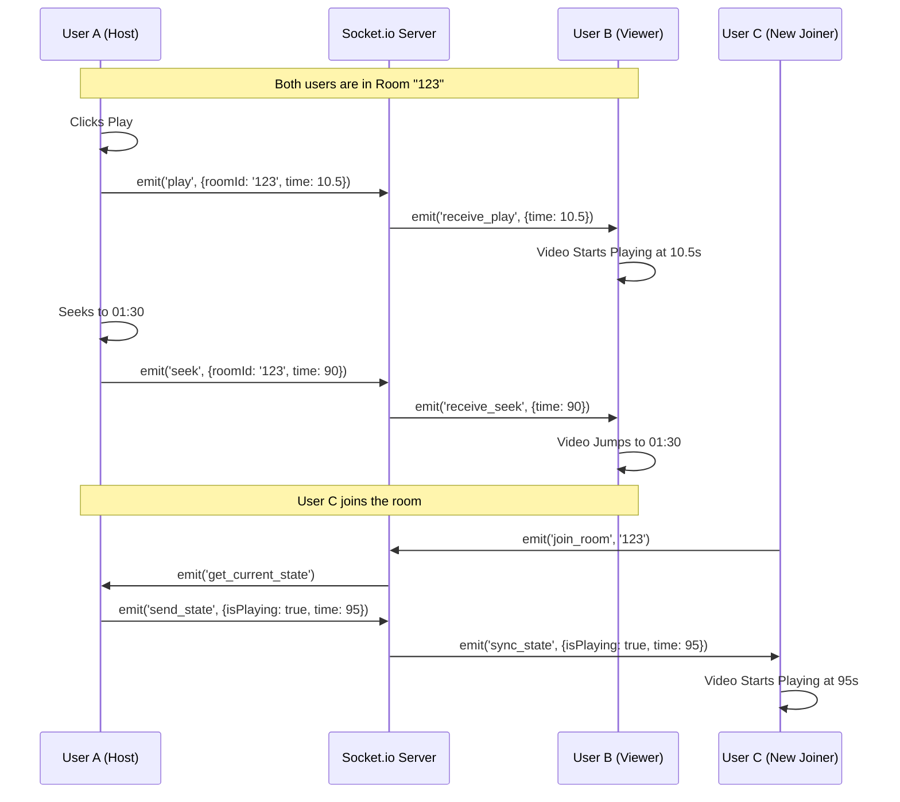

# Connect to Connect - System Architecture

This document outlines the high-level architecture and data flow for the Connect to Connect application.

## 1. High-Level Component Diagram

This diagram shows how the different parts of the system interact.

```mermaid
graph TD
    subgraph "Client Side (Frontend)"
        UserA[User A (Browser)]
        UserB[User B (Browser)]
        
        subgraph "Next.js App"
            UI[User Interface]
            SocketClient[Socket.io Client]
            Player[Video Player Component]
        end
    end

    subgraph "Server Side (Backend)"
        LB[Load Balancer / Reverse Proxy]
        
        subgraph "Node.js Server"
            Express[Express API]
            SocketServer[Socket.io Server]
            RoomMgr[Room Manager Logic]
        end
        
        DB[(In-Memory Store / Redis)]
    end

    UserA -->|HTTP / WebSocket| LB
    UserB -->|HTTP / WebSocket| LB
    LB --> Express
    LB --> SocketServer
    
    SocketServer <--> RoomMgr
    RoomMgr <--> DB
```

## 2. Synchronization Flow (Sequence Diagram)

This diagram illustrates what happens when User A clicks "Play" or seeks the video.



## 3. Data Structures

### Room Object (Server State)
```json
{
  "roomId": "room-1234",
  "users": [
    { "socketId": "abc-1", "username": "Alice" },
    { "socketId": "def-2", "username": "Bob" }
  ],
  "currentVideoUrl": "https://youtube.com/watch?v=...",
  "isPlaying": true,
  "lastKnownTime": 45.5,
  "lastUpdated": 1678900000
}
```
